# 👩‍🍳모찌🍳
오늘 뭐 먹을지 매일 고민하는 사람,
<br>
늘 냉장고에 있는 식재료를 처리하지 못해서 그대로 버리는 사람,
<br>
색다른 레시피를 도전하고 싶은 사람,
<br>
그들을 위한 사용자 빅데이터 기반 🍽레시피 추천 서비스🥘

### 목차
1. [프로젝트 기간](#1-프로젝트-기간)
2. [사용한 기술 스택](#2-사용한-기술-스택)
3. [팀원 소개](#3-팀원-소개)
4. [폴더 구조](#4-폴더-구조)
5. [설계](#5-설계)
6. [주요 기능 설명](#6-주요-기능-설명)
7. [서비스 화면](#7-서비스-화면)

----

### 1. 프로젝트 기간
  - 2024.02.26 ~ 2024.04.05 (6주)

### 2. 사용한 기술 스택
  * React-Native
  * node.js
  * zustand
  * styled-component
  * axios

### 3. 팀원 소개
<table width="100%">
  <tr>
    <td width="33%" align="center">
      
      <b><a href="https://github.com/baloo365">나유경</a></b> 
    </td>
    <td width="33%" align="center">
      
      <b><a href="https://github.com/goldbutnew">이금현</a></b> 
    </td>
    <td width="33%" align="center">
      
      <b><a href="https://github.com/uuniversey">이우주</a></b> 
    </td>
  </tr>
  <tr>
    <td width="33%" align="center">
      메인 스크린<br>
      리캡 스크린(쇼츠 제작)<br>
      로딩 스크린<br>
      추천 스크린<br>
      요리일기 C
    </td>
    <td width="33%" align="center">
      UI/UX<br>
      랜딩 스크린(소셜 로그인)<br>
      냉장고 스크린<br>
      요리일기 공유/저장<br>
      요리 월드컵
    </td>
    <td width="33%" align="center">
      git 관리<br>
      요리일기 RD<br>
      레시피 스크린<br> 
      STT, TTS<br>
      유저 스크린
    </td>
  </tr>
</table>

### 4. 폴더 구조
```
src
├─assets
│  ├─fonts
│  ├─frames
│  ├─fridge
│  ├─illustration
│  └─landing
├─components
│  ├─Animation
│  ├─AutoWord
│  ├─Button
│  ├─Carousel
│  ├─Dropdown
│  ├─Fonts
│  ├─Header
│  └─Loading
├─navigation
├─screens
│  ├─diary
│  ├─fridge
│  ├─landing
│  ├─main
│  ├─profile
│  ├─recipe
│  ├─recommend
│  └─search
├─store
└─typings
```

### 5. 설계
* 목업
  <table>
    <tr>
      <td>
        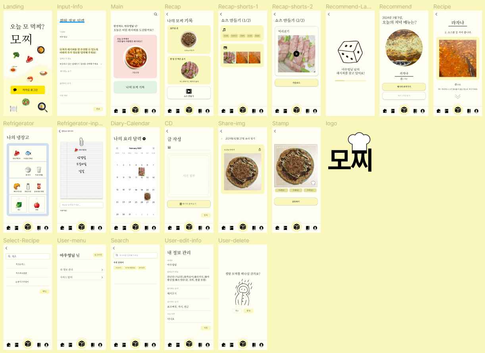
      </td>
    </tr>
  </table>

* 플로우차트
  <table>
    <tr>
      <td>
        
      </td>
    </tr>
  </table>

### 6. 주요 기능 설명
랜딩 스크린
- 카카오 소셜 로그인

메인 스크린
- 랜덤 레시피 추천
- 최다 조회 레시피

냉장고 스크린
- 재료 등록/삭제
- 재료 검색 텍스트 자동 완성

요리일기 스크린
- 게시글 CRD
- 게시글 커스텀 공유/저장

추천 스크린
- 요리 월드컵이 포함된 랜딩 스크린

레시피 스크린
- tts/stt 음성 인식 구현

리캡/쇼츠 스크린
- 비디오 생성(moviepy 활용)

유저 스크린 
- 로그아웃
- 회원 탈퇴
- 재료 검색 텍스트 자동 완성

검색 스크린
- 레시피 검색 텍스트 자동 완성

### 7. 서비스 화면
* 랜딩 스크린
  <table>
    <tr>
      <td>
        
      </td>
      <td>
        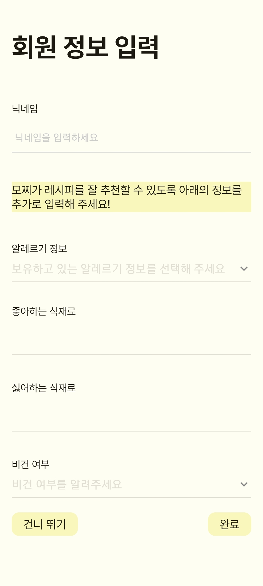
      </td>
      <td>
        
      </td>
      <td>
        
      </td>
    </tr>
  </table>

* 냉장고 스크린
  <table>
    <tr>
      <td>
        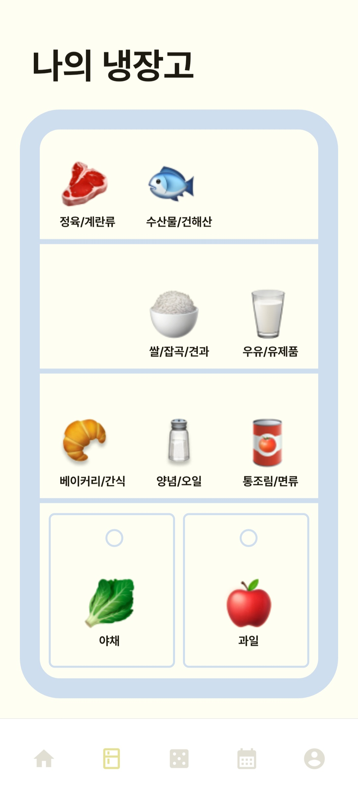
      </td>
      <td>
        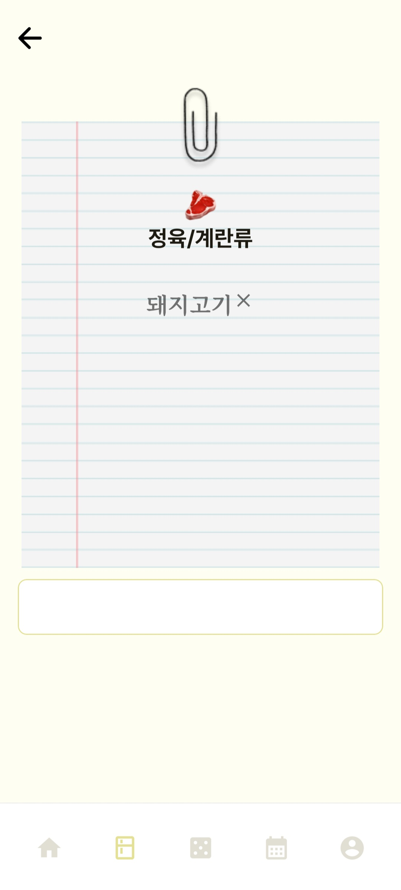
      </td>
      <td>
        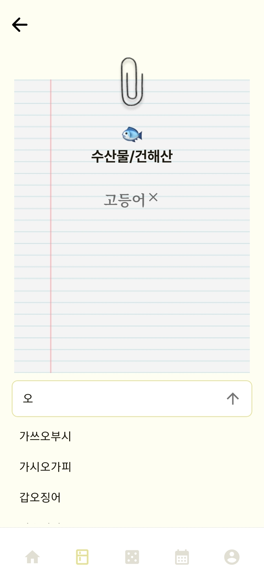
      </td>
      <td>
        
      </td>
    </tr>
  </table>

* 메인/검색 스크린
  <table>
    <tr>
      <td>
        
      </td>
      <td>
        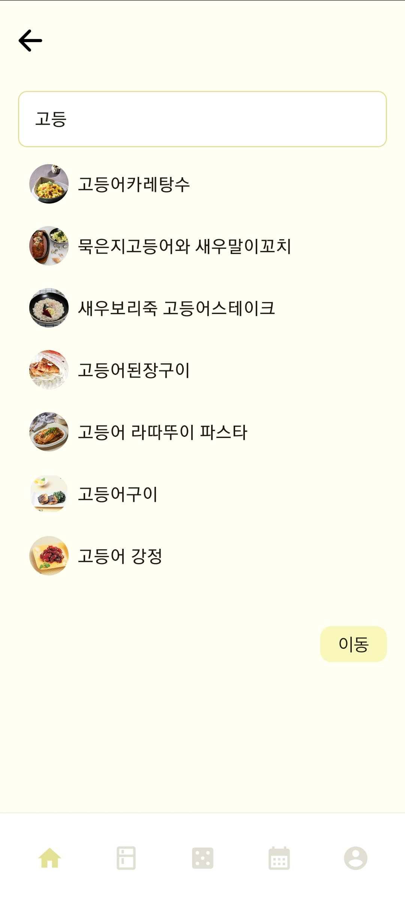
      </td>
      <td>
        
      </td>
      <td>
        
      </td>
    </tr>
  </table>

* 리캡 스크린
  <table>
    <tr>
      <td>
        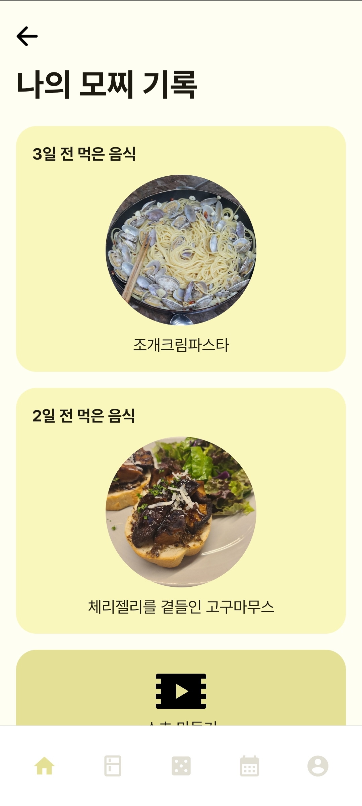
      </td>
      <td>
        
      </td>
      <td>
        
      </td>
      <td>
        
      </td>
    </tr>
  </table>

* 추천 스크린
  <table>
    <tr>
      <td>
        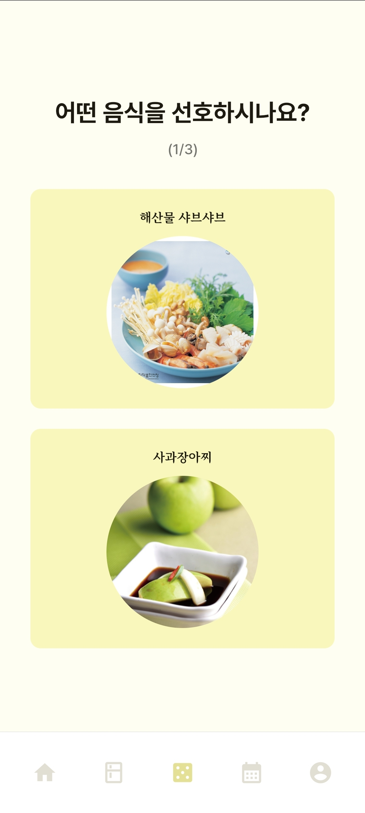
      </td>
      <td>
        
      </td>
      <td>
        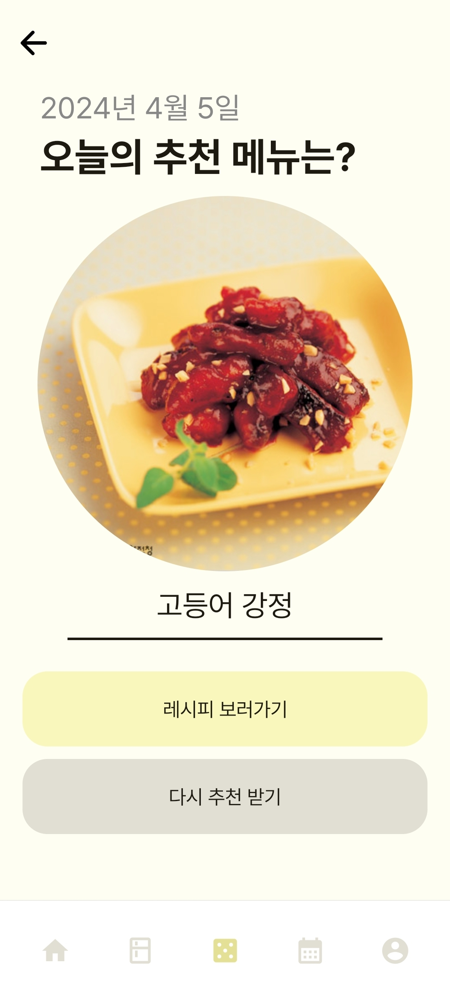
      </td>
      <td>
        
      </td>
    </tr>
  </table>

* 레시피 크린
  <table>
    <tr>
      <td>
        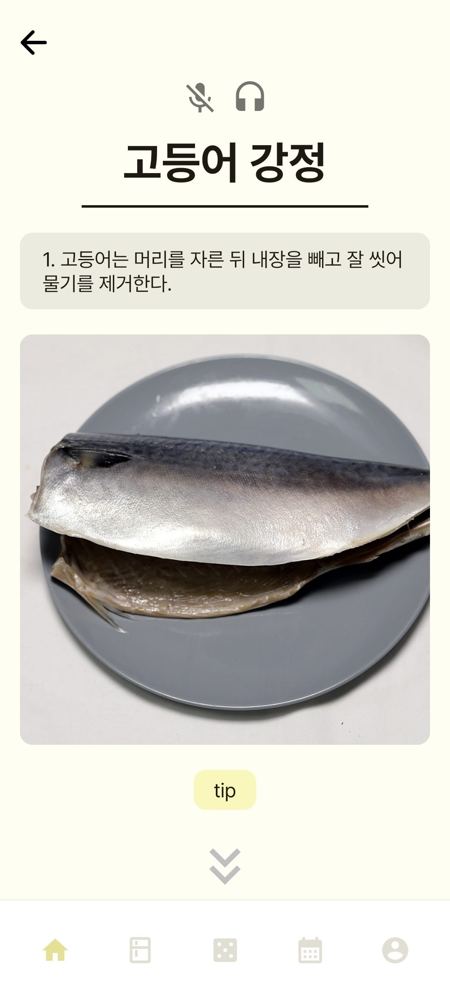
      </td>      
      <td>
        
      </td>
      <td>
        
      </td>
      <td>
        
      </td>
    </tr>
  </table>

* 요리일기 스크린
  <table>
    <tr>
      <td>
        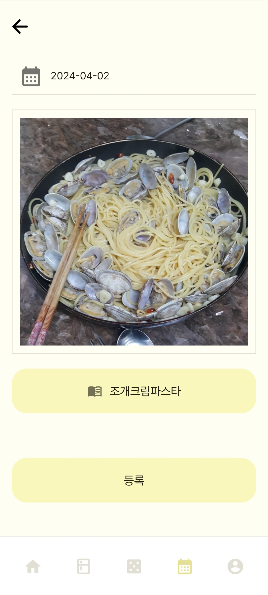
      </td>
      <td>
        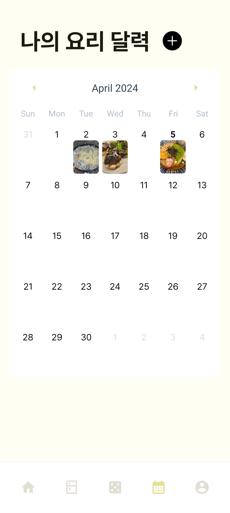
      </td>
      <td>
        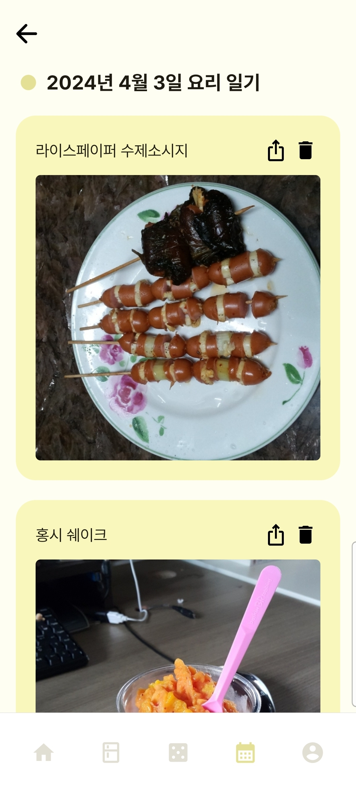
      </td>
      <td>
        
      </td>
    </tr>
  </table>

* 유저 스크린
  <table>
    <tr>
      <td>
        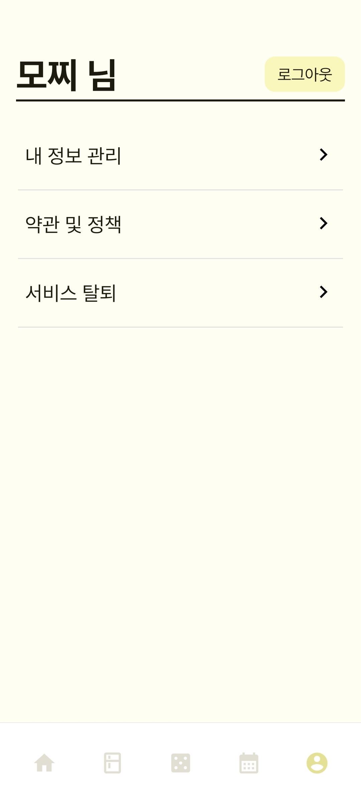
      </td>    
      <td>
        
      </td>
      <td>
        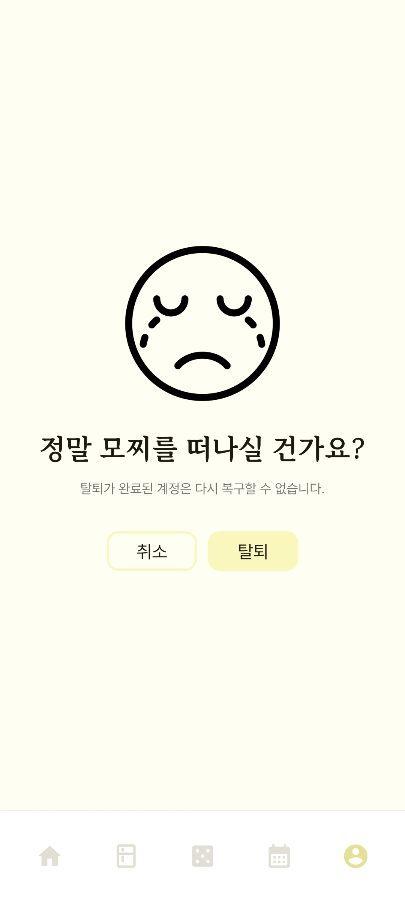
      </td>
      <td>
        
      </td>
    </tr>
  </table>
